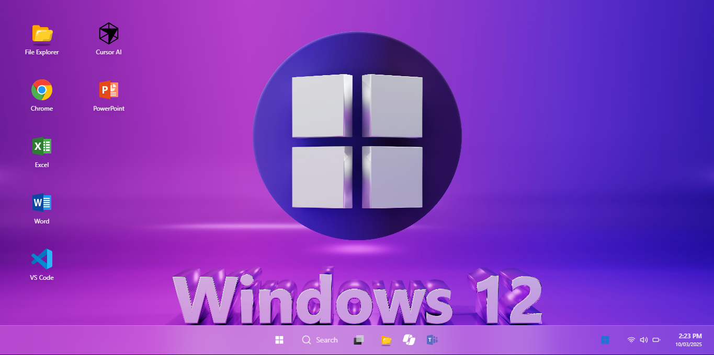
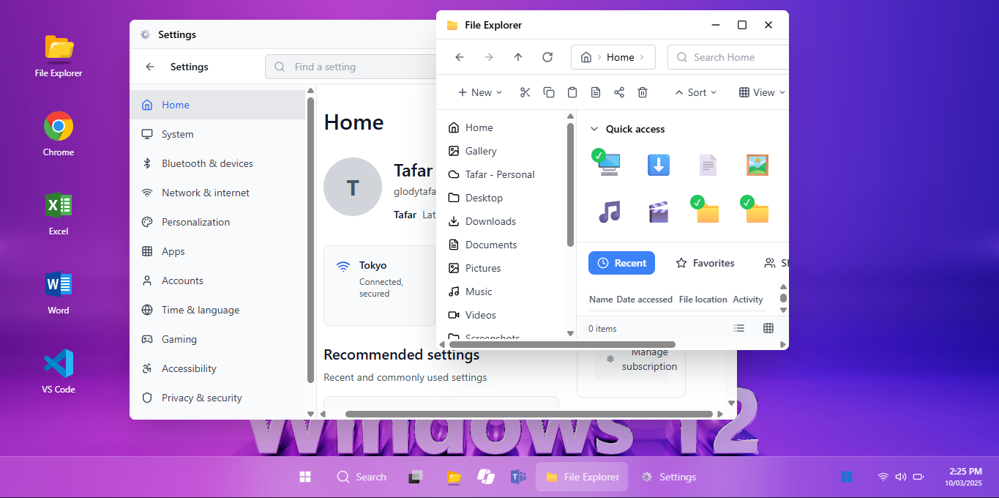
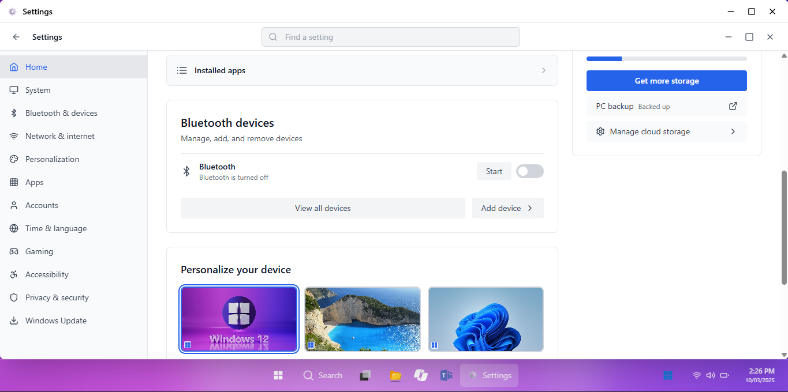
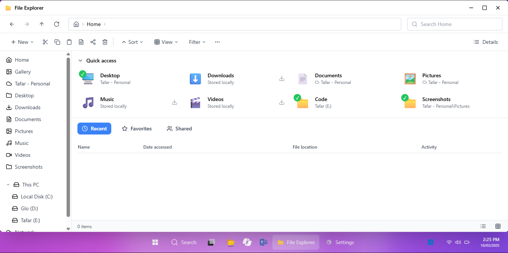

# Microsoft OS UI Redesign (Windows-in-the-Browser)

<div align="center">
  
  <p><em>Main desktop view</em></p>

  
  <p><em>Widgets panel and Taskbar in action</em></p>

  
  <p><em>Settings – Home page (Phase 2, Step 1)</em></p>

  
  <p><em>File Explorer window</em></p>
</div>

A fully-featured, React + Vite web application that recreates the Windows 11/12 desktop experience directly in the browser.  It includes a desktop with draggable icons, taskbar, start-menu, widgets, window management, and a growing suite of system apps – all persisted in localStorage and designed with TailwindCSS.

---

## Quick Start

```bash
# Install dependencies
npm install

# Start the dev server
npm run dev

# Build for production
npm run build
```

The development server will start on `http://localhost:5173` by default.

---

## 🗺️ Project Structure

```text
project/
│ index.html            # Entry HTML (favicon & mounting point)
│ vite.config.ts        # Vite configuration
│ tailwind.config.js    # Tailwind theme
│ tsconfig.*            # TypeScript configs
│ public/               # Static assets (favicon, wallpapers,…)
└─ src/
   ├─ components/       # UI building blocks (Taskbar, StartMenu, Widgets, …)
   ├─ hooks/            # Custom React hooks (file system, weather, news …)
   ├─ context/          # Global providers (ThemeContext)
   ├─ services/         # API wrappers (weather, crypto, news)
   ├─ utils/            # Helpers & localStorage wrapper
   └─ types/            # Shared TypeScript types
```

---

## Phase 1 – Core Desktop (Finished)
Phase 1 delivered a working replica of the Windows desktop environment:

* Desktop with draggable SVG icons & context menu
* Taskbar with Start button, search, widgets, notification center & system tray
* Start Menu showing pinned apps, recent items, power options & profile
* Widgets panel (Weather, News, Calendar, Crypto, Email)
* File Explorer app with virtual file-system placeholder
* Window manager (move, resize, minimize, maximize, close, z-index)
* System states: lock screen, sleep, shutdown, restart
* Light / dark theme support via `ThemeContext`
* Persistent state using localStorage

See `Phase1.md` for the detailed implementation notes.

---

## 🚧 Phase 2 – Settings & Advanced Features (IN PROGRESS)
We have **completed Step 1** of Phase 2 – the **Settings Home** page and basic infrastructure:

* Modular `SettingsLayout` with sidebar navigation & top-bar search
* `SettingsHome` implementation with:
  * User profile card
  * Network & system-info cards
  * Recommended settings section
  * Bluetooth devices management (toggle & mock devices)
  * Microsoft 365 subscription & cloud-storage cards
  * Theme preview grid, color-mode toggle & wallpaper selector
* Context-driven settings persisted via `storage.ts`

### What’s Next in Phase 2
The remaining milestones are open for contributors:

1. **Personalization Settings Page** – backgrounds, colors, themes, lock-screen
2. **System Settings** – display, about, storage, power & battery (mocked)
3. **Enhanced File System Operations** – real CRUD, drag-&-drop, recycle-bin workflow
4. **Account Management & User Settings** – profile editor, sign-in options
5. **Additional Settings Pages** – apps, network, privacy, accessibility, update
6. **System Apps** – Notepad, Calculator, Task Manager, Paint (simple versions)
7. **UI/UX Polish** – animations, keyboard shortcuts, accessibility improvements
8. **Supabase Integration Prep** – groundwork for cloud sync (Phase 3)

Refer to `Phase2.md` for the full step-by-step plan.

---

## 🤝 Contributing

We welcome pull requests that align with the Phase 2 roadmap.

1. Fork the repo & create a new branch from `main`.
2. Follow the code style – ESLint & Prettier are configured.
3. Provide clear commit messages & update docs where applicable.
4. Ensure `pnpm lint` and `pnpm typecheck` pass before opening a PR.
5. For major features, please open an issue first to discuss the design.

---

## 📜 License

This project is licensed under the MIT License – see the [LICENSE](LICENSE) file for details.

---

## 🙏 Acknowledgements

* Windows, Microsoft 365 and all related trademarks are property of Microsoft Corporation.
* Icons by [Lucide](https://lucide.dev/) and custom SVGs.
* Wallpapers from [Pexels](https://pexels.com/).
